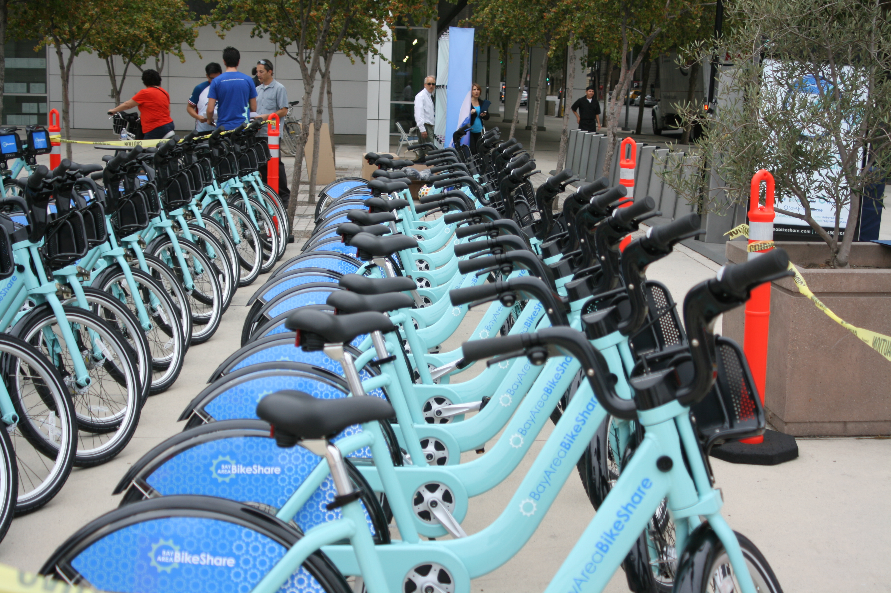

# San-Fransisco-Bay-Area-Bike-Sharing-Investigation

## Overview
A bicycle-sharing system, bike share program,public bicycle scheme, or public bike share (PBS) scheme, is a shared transport service where bicycles are available for shared use to individuals on a short-term basis at low or zero cost. It was initiated to as way to promote bicycles as a non-polluting form of transportation — and bike-lease businesses. [see](https://en.wikipedia.org/wiki/Bicycle-sharing_system)

The systems themselves include both docking and dockless systems, where docking systems allow users to borrow a bike from a dock, i.e., a technology-enabled bicycle rack and return at another node or dock within the system — and dockless systems offer a node-free system relying on smart technology. In either format, systems may incorporate smartphone web mapping to locate available bikes and docks.[see](https://en.wikipedia.org/wiki/Bicycle-sharing_system)

## Method
In this project, I analyse the Bike sharing datasets for the [first quarter of 2019](https://s3.amazonaws.com/fordgobike-data/index.html) to find the factors affecting biking durations. 

The dataset is distributed in four different files with each file showing the data for a month. These files were merged together and missing values and outliers were taken care of for quality analysis.

I extracted only the features of interest and explored their distributions with histograms and column charts. I then check the relationships between the variables of interest using scatter plots and heat maps. I also study how other variables like age, hour, user type, and gender can affect the biking durations using multivariate plots. 

## Findigs
I investigated the factors that may affect the duration taken by a biker in each biking cycle. In my investigation I noted the following:

- most of the bikers are, most likely, 9-5 workers as the 8th and the 17th hours are the busiest.
- most of the rides happened during the daytime 
- there are almost equal proportions of different genders in each hour of the day that share bikes
- a good number of those who took rides between 3:00 PM to 2:00 AM ended up spending close to one day before checking in.
- rides between 3:00 AM and 6:00 AM rarely exceed a 15-hour duration
- most of the rides by the other gender lasted less than an hour.
- riders above 60 years of age and teenagers are less likely to ride a bike for longer durations.
- most of those that take longer durations are in the age range of 20-40
- the user type is not a determinant of biking duration.
